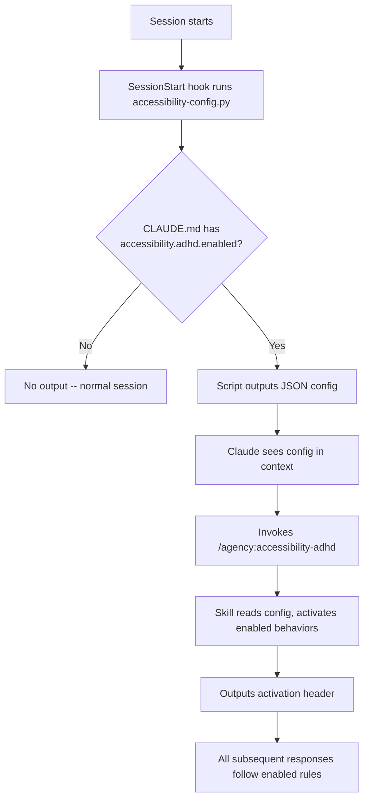

# ADHD Accessibility Mode

A Claude Code behavioral overlay that adapts how Claude communicates for ADHD users. Instead of changing what Claude does, it changes how Claude talks to you -- shorter responses, fewer decisions, visible progress, and guardrails against rabbit holes.

## Quick Start

Run the guided setup:

```
/agency:init-adhd
```

This walks you through choosing which behaviors to enable and writes the config to your CLAUDE.md. Or add the config manually to the top of your `~/.claude/CLAUDE.md` (or any project-level `CLAUDE.md`):

```yaml
---
accessibility:
  adhd:
    enabled: true
---
```

Either way, ADHD mode auto-activates on your next session with your chosen behaviors enabled.

## What Changes

With ADHD mode active, Claude will:

- **Chunk work into tiny steps** instead of presenting big plans
- **Make decisions for you** instead of asking "would you prefer X or Y?"
- **Keep responses to 3-4 lines** instead of multi-paragraph explanations
- **Never stop moving** -- each response ends with the next action, not a question
- **Show progress constantly** -- "3/7 done" counters, brief celebrations
- **Anchor you in context** -- every response starts with where you are
- **Catch rabbit holes** -- flags tangents and offers to park them
- **Track time** -- notes elapsed time, suggests break points
- **Format cleanly** -- no walls of text, no ALL CAPS, generous whitespace

## Activation Methods

### Auto-activation (recommended)

Add the YAML frontmatter to any CLAUDE.md file. The `SessionStart` hook detects it automatically.

**Global** (`~/.claude/CLAUDE.md`) -- applies to every project:

```yaml
---
accessibility:
  adhd:
    enabled: true
---

# Your existing CLAUDE.md content below
...
```

**Project-level** (`./CLAUDE.md` or any parent directory) -- applies to one project:

```yaml
---
accessibility:
  adhd:
    enabled: true
    time_awareness: false
---

# Project instructions below
...
```

Project-level settings override global settings. You can enable globally and disable specific behaviors per-project.

### Manual activation

Run the skill directly in any session:

```
/agency:accessibility-adhd
```

This activates all 9 behaviors with default settings, regardless of CLAUDE.md config.

### Deactivation

Say any of these in conversation:

- "turn off ADHD mode"
- "disable accessibility mode"
- "go back to normal"

Or start a new session. To disable auto-activation, remove or set `enabled: false` in your CLAUDE.md frontmatter.

## Configuration Reference

Every behavior can be toggled individually. When `enabled: true`, all behaviors default to `true` unless you explicitly set them to `false`.

```yaml
---
accessibility:
  adhd:
    enabled: true                    # Master switch (required)
    micro_chunking: true             # Tiny steps, max 3 items, TodoWrite everything
    reduced_decisions: true          # Opinionated choices, minimal questions
    max_options: 2                   # Max choices when Claude must ask (default: 2)
    response_brevity: true           # Short prose, bullets over paragraphs
    max_prose_lines: 4               # Max non-code lines per response (default: 4)
    momentum: true                   # Never end with a question, always state next action
    progress_dopamine: true          # Progress counters, micro-celebrations
    context_anchoring: true          # "You are here" line at top of every response
    anti_rabbit_hole: true           # Tangent detection, scope creep alerts
    time_awareness: true             # Elapsed time tracking, break suggestions
    break_interval_minutes: 30       # Minutes before suggesting a break (default: 30)
    sensory_friendly: true           # Clean formatting, no ALL CAPS, generous whitespace
---
```

### Behavior Details

#### 1. Micro-Chunking (`micro_chunking`)

Breaks every task into the smallest possible steps. Each todo item targets under 5 minutes. Never presents more than 3 action items at once. Uses `TodoWrite` aggressively so nothing lives only in prose.

**Without**: "Here's the plan: set up the database, create the migration, write the model, add validation, create the API endpoint, write tests, and update the docs."

**With**: "Step 1/3: Create the migration file for the users table. Starting now."

#### 2. Reduced Decision Points (`reduced_decisions`)

Makes opinionated choices instead of presenting options. Only asks when genuinely ambiguous, and even then limits to `max_options` choices with a clear recommendation.

**Without**: "Would you prefer PostgreSQL, MySQL, or SQLite? We could also consider MongoDB if you want a document store. Each has trade-offs..."

**With**: "I'll use PostgreSQL -- it fits best here. Starting the migration."

#### 3. Response Brevity (`response_brevity`)

Caps prose at `max_prose_lines` lines (default 4). Leads with what changed or what's next. No preamble, no "Great question!", no filler. Bullet points over paragraphs.

**Without**: "Great question! Let me think about this. So the issue here is that the authentication middleware is checking the session token against the wrong store. What's happening is that when a user logs in, the token gets stored in Redis, but the middleware is checking the database. This mismatch means that..."

**With**:
- Auth middleware checks DB but tokens are in Redis
- Fix: point middleware at Redis session store
- Updating now

#### 4. Momentum Preservation (`momentum`)

Never ends a response with "What would you like to do next?" or "Let me know if you have questions." Instead, states the next action and starts it. If blocked, says what's blocking and what it will do instead.

**Without**: "I've finished the migration. Let me know what you'd like to do next, or if you have any questions about the schema!"

**With**: "Migration done. Moving to the model class."

#### 5. Progress Dopamine (`progress_dopamine`)

Shows "3/7 done" style counters. Celebrates completions briefly ("Done.") without lengthy summaries. Frames remaining work positively ("only 2 left" not "still 2 to go").

**Example**: "Done. (5/7) -- only 2 left."

#### 6. Context Anchoring (`context_anchoring`)

Every response starts with a one-line anchor showing what you're working on and where you are in it. After interruptions, proactively re-anchors.

**Format**: **[Context: Building user auth -- step 3/5: session middleware]**

After a tangent: "Back to user auth -- we were on step 3/5 (session middleware)."

#### 7. Anti-Rabbit-Hole Guardrails (`anti_rabbit_hole`)

Detects tangents and flags them immediately. Offers to park them in a separate "Parked" todo group (visible but not blocking). Calls out scope creep explicitly.

**Example**: "That's a tangent -- want to park it or switch? (Parking keeps it tracked without derailing the current task.)"

**Scope creep**: "Scope creep alert -- we're drifting from the auth middleware into refactoring the entire session store. Park it?"

#### 8. Time Awareness (`time_awareness`)

After `break_interval_minutes` (default 30) of active work, notes elapsed time. Suggests natural break points. Frames work in time-bounded chunks.

**Example**: "Good stopping point -- 4 tasks done, 2 remaining. Been at it 35 min. Break, or push through?"

**Estimation**: "This next part is ~5 min of work."

#### 9. Sensory-Friendly Formatting (`sensory_friendly`)

No dense code walls without context headers. Generous whitespace. Section headers on anything longer than 5 lines. Never ALL CAPS -- always **bold**. Code blocks show only the relevant section.

## Common Configurations

### All behaviors (default)

```yaml
---
accessibility:
  adhd:
    enabled: true
---
```

### Focus-only (no time tracking)

For users who find time awareness anxiety-inducing rather than helpful:

```yaml
---
accessibility:
  adhd:
    enabled: true
    time_awareness: false
---
```

### Tight brevity

For users who want even shorter responses:

```yaml
---
accessibility:
  adhd:
    enabled: true
    max_prose_lines: 2
    max_options: 1
---
```

### Exploration-friendly

For users who enjoy rabbit holes but want the other guardrails:

```yaml
---
accessibility:
  adhd:
    enabled: true
    anti_rabbit_hole: false
---
```

### Longer sessions

For users who prefer longer uninterrupted work blocks:

```yaml
---
accessibility:
  adhd:
    enabled: true
    break_interval_minutes: 60
---
```

### Minimal (just the essentials)

Only the three highest-impact behaviors:

```yaml
---
accessibility:
  adhd:
    enabled: true
    micro_chunking: true
    reduced_decisions: true
    momentum: true
    response_brevity: false
    progress_dopamine: false
    context_anchoring: false
    anti_rabbit_hole: false
    time_awareness: false
    sensory_friendly: false
---
```

## Layering with Project Settings

Global and project-level configs merge. Project-level keys override global keys.

**Global** (`~/.claude/CLAUDE.md`):

```yaml
---
accessibility:
  adhd:
    enabled: true
    break_interval_minutes: 30
---
```

**Project** (`~/projects/complex-app/CLAUDE.md`):

```yaml
---
accessibility:
  adhd:
    break_interval_minutes: 15
    max_prose_lines: 2
---
```

**Result in `complex-app/`**: All 9 behaviors enabled, breaks at 15 min, max 2 prose lines. Everything else uses global or default values.

**Result everywhere else**: All 9 behaviors enabled, breaks at 30 min, max 4 prose lines (defaults).

## Compatibility

ADHD mode stacks with other agency features:

| Feature | Interaction |
|---------|-------------|
| Agent sessions (`/load-agent`) | ADHD rules apply to the loaded agent's communication style |
| Spec Kitty workflows | Micro-chunking and progress tracking integrate naturally with task phases |
| Learning/Explanatory mode | Insights still appear but capped at 2 bullet points |
| Plan mode | Plans auto-chunk into 5-minute steps |

ADHD mode does **not** override:

- Project conventions in CLAUDE.md files (other than communication style)
- Safety constraints and tool permissions
- Code quality standards or git discipline rules

## How It Works



The detection script (`scripts/accessibility-config.py`) reads CLAUDE.md files from most general (global) to most specific (project-level), parses YAML frontmatter, and merges configs. It only produces output when `enabled: true` is found, adding zero noise to sessions that don't use it.

## Troubleshooting

**Mode doesn't auto-activate**:
- Verify your CLAUDE.md has `---` delimiters around the YAML (must be at the very top of the file)
- Check `enabled: true` is set (not just the behavior flags)
- Run manually to test: `uv run scripts/accessibility-config.py` from the agent-ops directory

**Behavior X isn't working**:
- Check that the behavior key isn't set to `false` in any CLAUDE.md in the directory hierarchy
- Run the config script to see the merged output -- it shows which behaviors are enabled/disabled

**Too aggressive / not enough**:
- Tune `max_prose_lines` (try 2 for tighter, 6 for looser)
- Tune `max_options` (1 = never ask, 3 = slightly more flexible)
- Disable individual behaviors that don't work for you -- this is designed to be personal
