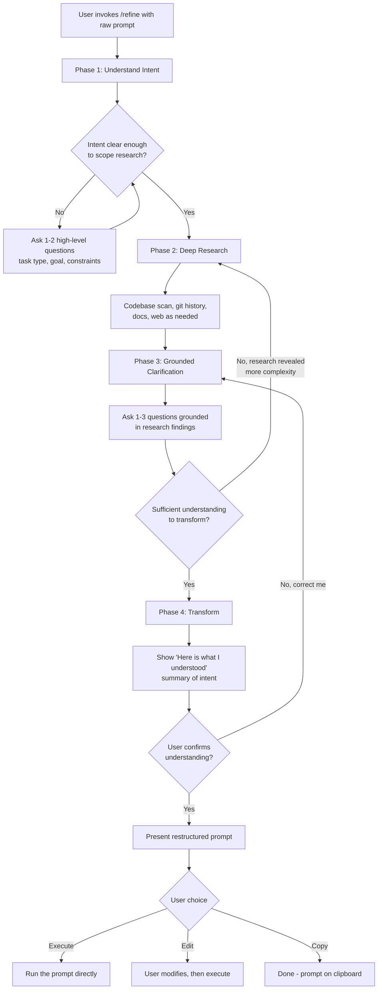

# Prompt Refiner -- Design Document

**Date**: 2026-03-07
**Status**: Approved
**Location**: `plugins/core/skills/prompt-refiner/`
**Idea**: [010-prompt-refiner](https://github.com/InfiniteRoomLabs/ideas/blob/main/ideas/010-prompt-refiner.md)

## Overview

A Claude Code skill that transforms vague or rambling prompts into clean, structured instructions through a conversational loop with deep research. Invoked explicitly via `/refine`.

## Decisions

| Decision | Choice | Rationale |
|----------|--------|-----------|
| Trigger model | Skill-based (explicit) | User opts in -- justifies deep research overhead |
| Domain | Claude Code prompts | Scoped to dev tasks, not general-purpose |
| Research depth | Deep (codebase, git, docs, web) | Explicit invocation justifies the cost |
| Output | Restructured prompt + execute/edit/copy | Gives user full control over what happens next |
| Rambling handling | Full rewrite with transformation summary | Catches misinterpretations before final output |
| Gap-filling | Adaptive, leaning thorough | Simple tasks exit fast, complex/risky tasks get more rounds |
| Architecture | Conversational loop | Scopes research by intent, catches misinterpretations early |
| Plugin location | `agent-ops/plugins/core/` | General-purpose capability any team member uses |
| Framework approach | No framework religion | Clean structured output, not CO-STAR/RISEN labels |

## Conversational Loop Flow



### Phase 1: Understand Intent

Categorize the task (bug fix, feature, refactor, exploration, config, docs, etc.) and identify the user's actual goal vs what they literally typed. Ask 1-2 questions only if needed -- if the raw prompt already makes the category obvious, skip straight to research.

### Phase 2: Deep Research

Scoped by intent. Research actions per task type:

| Task Type | Research Actions |
|-----------|-----------------|
| Bug fix | Git log (recent changes), Grep for error patterns, Read failing code, Check test coverage |
| Feature | Explore existing architecture, Glob for similar components, Read docs/README, Check git log |
| Refactor | Map dependencies, Read test coverage, Git blame for change frequency, Identify coupling |
| Exploration | Broad codebase scan via Explore agent, Read project docs, Map directory structure |
| Config/Infra | Read existing config, Check env files, Git log for config changes, Read deploy docs |
| Docs | Read target code, Check existing doc style, Read CLAUDE.md conventions, Find examples |

Research budget: 5-8 files/commands per round. Findings are internal -- they surface as grounded question options and baked-in context in the final prompt.

### Phase 3: Grounded Clarification

Every question cites specific findings. Not "which file?" but "I found `src/auth/login.ts` and `src/auth/oauth.ts` both handle authentication -- which are you targeting?"

- 1-3 questions per round via `AskUserQuestion`
- Multiple choice with research-grounded options where possible
- Adaptive thoroughness: simple tasks get 1 round, complex/risky tasks (auth, data deletion, infra) get 2-3
- Max 3 research-clarify loops total

### Phase 4: Transform

1. Show plain-language "here's what I understood" summary
2. User confirms or corrects
3. Present restructured prompt in structured format
4. User picks: Execute / Edit / Copy

## Structured Prompt Output Format

Sections included only when relevant -- not every prompt needs all of them:

```
## Goal
[1-2 sentences: what the user actually wants accomplished]

## Context
[Files involved, current state, constraints discovered during research]

## Requirements
[Specific requirements extracted from the rambling + clarification answers]
- Requirement 1
- Requirement 2

## Approach
[If the user expressed a preference or research suggests one]

## Boundaries
[What NOT to do -- only if constraints specified or task is risky]
```

**Transformation principles:**
- Distill, don't decorate -- shorter and clearer beats longer
- Preserve intent, not wording
- Surface implicit assumptions
- Research findings become baked-in context (file paths, function names, error messages)
- No framework labels -- just clean, direct instructions

## File Structure

```
agent-ops/plugins/core/skills/prompt-refiner/
    SKILL.md                          # Core skill logic (~200-250 lines)
    references/
        research-strategies.md        # Task-scoped research checklists
        question-patterns.md          # Grounded question templates by category
        transformation-examples.md    # Before/after examples per task type
```

**Token budget:**
- SKILL.md always loaded: ~2-3k tokens
- Each reference file on-demand: ~1-2k tokens each
- Worst case (all loaded): ~7-9k tokens
- Typical case (SKILL.md + 1 reference): ~4-5k tokens

## User Interaction Design

**Invocation:**
```
/refine fix the login thing, it's broken again, maybe the jwt stuff
       idk it was working yesterday but now users get kicked out
```

or just `/refine` (Claude asks what to refine).

**Escape hatches:**
- "Just do it" / "good enough" -- transforms with current understanding, skips remaining questions
- "Start over" -- resets from Phase 1
- User can edit the "here's what I understood" summary directly

**Execute behavior:** Passes the refined prompt into the conversation as if the user typed it. Does not re-invoke itself.

## Research Lineage

Informed by analysis of 7 existing prompt improvement tools via deep-think debate team:

1. `severity1/claude-code-prompt-improver` (1.2k stars) -- best pattern: research-before-questions, progressive disclosure
2. `hancengiz/claude-code-prompt-coach-skill` -- best pattern: context-aware scoring, the "golden rule"
3. `ckelsoe/claude-skill-prompt-architect` (21 stars) -- best pattern: framework decision tree, quality dimensions
4. `it-bens/claude-code-plugins` -- best pattern: multi-model routing, plugin architecture
5. `daymade/claude-code-skills` (624 stars) -- best pattern: EARS methodology for structured requirements
6. `johnpsasser/claude-code-prompt-optimizer` -- rejected: model mismatch bug, double API cost
7. `jeremylongshore/claude-code-plugins-plus-skills` (1.5k stars) -- rejected: auto-generated content farm

Key patterns adopted: research grounds every question, progressive disclosure for token efficiency, adaptive thoroughness, before/after transformation display, bypass escape hatches.
